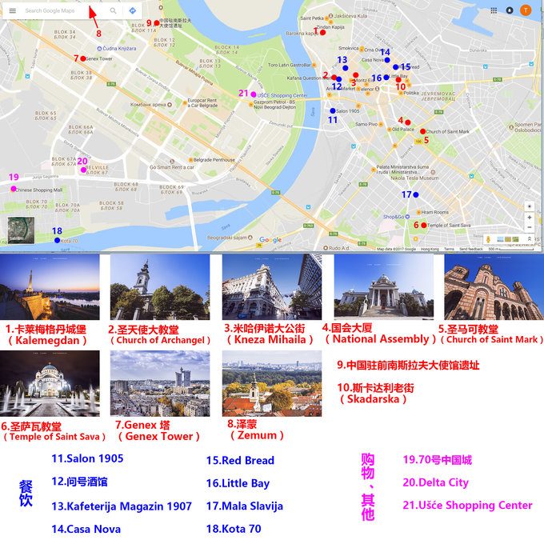
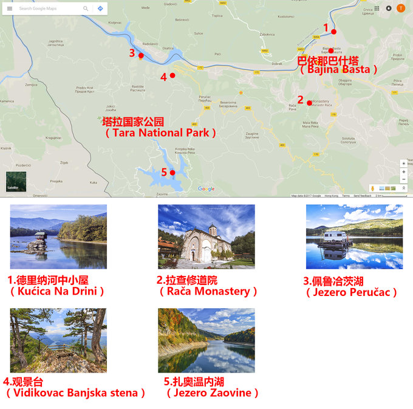
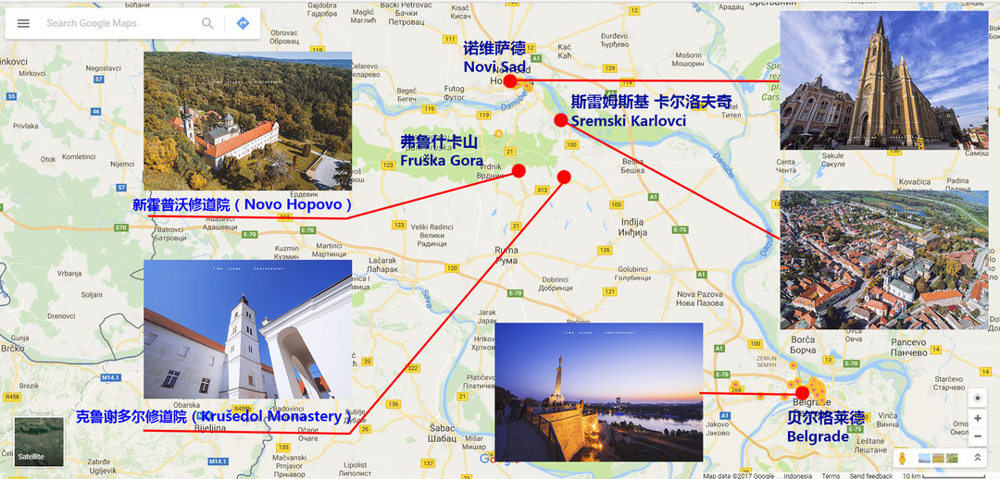
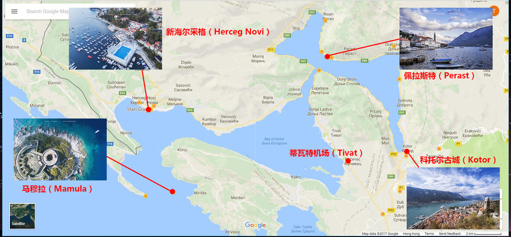
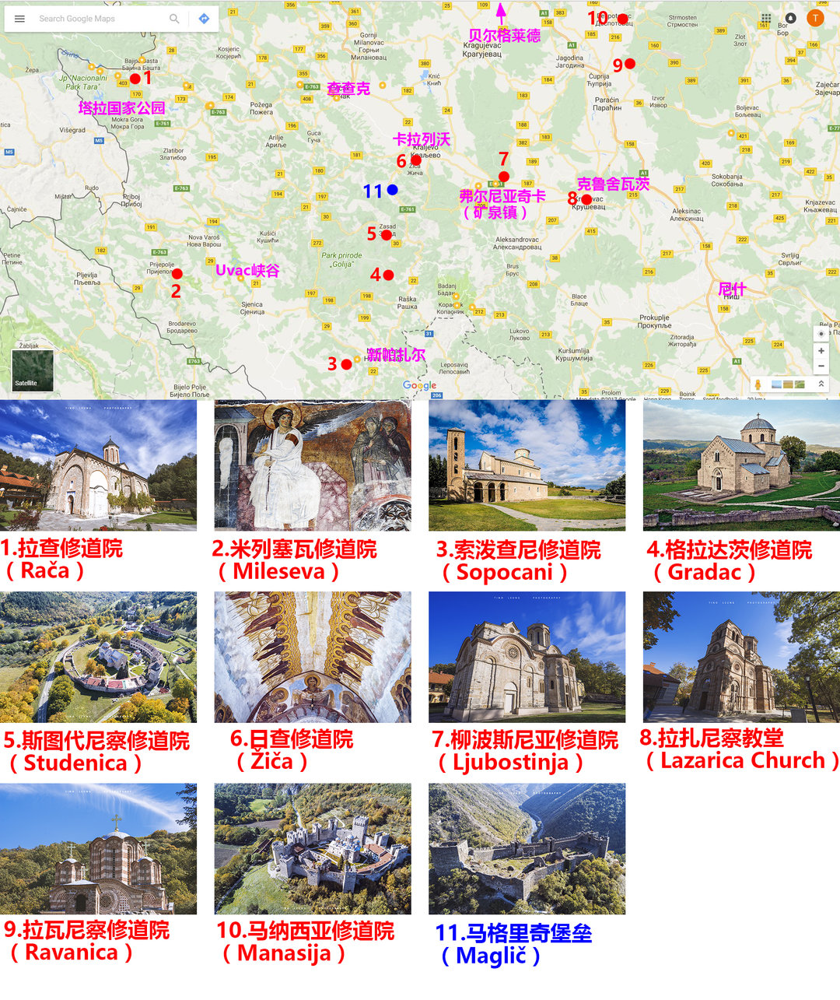

## Schedule
<!-- more -->

Date | Time | Activities | Accommodation | Remarks | Map
--- | :--: | :--: | :---: | :---: | :---:
April 7th - 8th | 23:00 - 5:20 | TK071 HK->İstanbul | | 出发：香港T1 | 
April 8th | 7:40 - 8:20 | TK1081 İstanbul->Belgrade | | 1h 45min | 
April 8th | 全天 | Topčider Park -> Sveti Sava Temple -> 共和国广场 -> Belgrade Fortress -> Great War Island | Belgrade | 第一天可能会由于时差比较累 | [Google Map View](https://www.google.com/maps/dir/%E8%B4%9D%E5%B0%94%E6%A0%BC%E8%8E%B1%E5%BE%B7%E5%B0%BC%E5%8F%A4%E6%8B%89%C2%B7%E7%89%B9%E6%96%AF%E6%8B%89%E6%9C%BA%E5%9C%BA+Aerodrom+Beograd+59,+Beograd+11180%E5%A1%9E%E5%B0%94%E7%BB%B4%E4%BA%9A/%D0%A1%D0%B2%D0%B5%D1%82%D0%BE%D0%B3+%D0%A1%D0%B0%D0%B2%D0%B5,+Beograd,+%E5%A1%9E%E5%B0%94%E7%BB%B4%E4%BA%9A/%E5%A1%9E%E5%B0%94%E7%BB%B4%E4%BA%9A%E8%B4%9D%E5%B0%94%E6%A0%BC%E8%8E%B1%E5%BE%B7+Trg+republike,+%E5%85%B1%E5%92%8C%E5%9B%BD%E5%B9%BF%E5%9C%BA/Belgrade+Fortress,+%E8%B4%9D%E5%B0%94%E6%A0%BC%E8%8E%B1%E5%BE%B7%E5%A1%9E%E5%B0%94%E7%BB%B4%E4%BA%9A/Great+War+Island,+%E8%B4%9D%E5%B0%94%E6%A0%BC%E8%8E%B1%E5%BE%B7%E5%A1%9E%E5%B0%94%E7%BB%B4%E4%BA%9A/@44.8197693,20.3673847,13z/data=!4m32!4m31!1m5!1m1!1s0x475a688a5214cf59:0xc3184c4bc7f300f9!2m2!1d20.291691!2d44.820498!1m5!1m1!1s0x475a700bb3b702cf:0x8c4fe8311c3f97e5!2m2!1d20.46787!2d44.8004214!1m5!1m1!1s0x475a7ab2453c4ba1:0xb81037438bba0036!2m2!1d20.4603199!2d44.8162551!1m5!1m1!1s0x475a6549015c2c53:0x160b799f3d48d2b2!2m2!1d20.450903!2d44.822633!1m5!1m1!1s0x475a65144b7d88b7:0x3e2055c8a0b8499e!2m2!1d20.4325128!2d44.8304371!3e0)
April 9th | 全天 | Belgrade -> Krusedol monastery -> Novi Sad -> Subotica -> Novi Sad | Belgrade or Novi Sad | 租车, 4h 31min or more | [Google Map View](https://www.google.com/maps/dir/Belgrade,+%E5%A1%9E%E5%B0%94%E7%BB%B4%E4%BA%9A/Kru%C5%A1edol+Monastery,+313,+%E5%A1%9E%E5%B0%94%E7%BB%B4%E4%BA%9A/Novi+Sad,+%E5%A1%9E%E5%B0%94%E7%BB%B4%E4%BA%9A/Subotica,+%E5%A1%9E%E5%B0%94%E7%BB%B4%E4%BA%9A/Belgrade,+%E5%A1%9E%E5%B0%94%E7%BB%B4%E4%BA%9A/@45.2755865,20.0750863,8.9z/data=!4m32!4m31!1m5!1m1!1s0x475a7aa3d7b53fbd:0x1db8645cf2177ee4!2m2!1d20.4489216!2d44.786568!1m5!1m1!1s0x475b01766c65b369:0xc682914f77cca9c7!2m2!1d19.9400407!2d45.1194434!1m5!1m1!1s0x475b10613de93455:0xb6f7d683724fe28!2m2!1d19.8335496!2d45.2671352!1m5!1m1!1s0x474366c168af38f9:0xdf19bd922a3d838e!2m2!1d19.6650593!2d46.1005467!1m5!1m1!1s0x475a7aa3d7b53fbd:0x1db8645cf2177ee4!2m2!1d20.4489216!2d44.786568!3e0)
April 10th | 全天 | Novi Sad -> Tara National Park (Perućac) | Perućac | 4h 51min or more | [Google Map View](https://www.google.com/maps/dir/Novi+Sad,+%E5%A1%9E%E5%B0%94%E7%BB%B4%E4%BA%9A/Peru%C4%87ac,+%E5%A1%9E%E5%B0%94%E7%BB%B4%E4%BA%9A/Tara+national+park,+Mokra+Gora,+%E5%A1%9E%E5%B0%94%E7%BB%B4%E4%BA%9A/@43.8783054,19.5441863,11.75z/data=!4m20!4m19!1m5!1m1!1s0x475b10613de93455:0xb6f7d683724fe28!2m2!1d19.8335496!2d45.2671352!1m5!1m1!1s0x4759b3a9e1709a6f:0x13125de029752c13!2m2!1d19.4316836!2d43.9573692!1m5!1m1!1s0x47584bdafcc3a383:0xa28ba6bb1c340a84!2m2!1d19.4581188!2d43.8483396!3e0)
April 11th | 全天 | Perucac -> Mecavnik -> Uzice -> 查查克 -> Belgrade | Belgrade | 4h 49min | [Google Map View](https://www.google.com/maps/dir/Peru%C4%87ac,+%E5%A1%9E%E5%B0%94%E7%BB%B4%E4%BA%9A/Drvengrad+-+Mecavnik,+Mokra+Gora,+%E5%A1%9E%E5%B0%94%E7%BB%B4%E4%BA%9A/%E5%A1%9E%E5%B0%94%E7%BB%B4%E4%BA%9A%E4%B9%8C%E6%97%A5%E7%AD%96/%E5%A1%9E%E5%B0%94%E7%BB%B4%E4%BA%9A%E6%9F%A5%E6%9F%A5%E5%85%8B/Belgrade,+%E5%A1%9E%E5%B0%94%E7%BB%B4%E4%BA%9A/@44.2048115,20.2216701,11.37z/data=!4m32!4m31!1m5!1m1!1s0x4759b3a9e1709a6f:0x13125de029752c13!2m2!1d19.4316836!2d43.9573692!1m5!1m1!1s0x47583632ed05ba15:0xdd78e2331a9d3100!2m2!1d19.5074369!2d43.7959892!1m5!1m1!1s0x4759d34266ef8b59:0x58e8ff863b5b6aab!2m2!1d19.842471!2d43.8555729!1m5!1m1!1s0x4757723fdaf79e2d:0x46460a390c51b8ce!2m2!1d20.3501652!2d43.8914144!1m5!1m1!1s0x475a7aa3d7b53fbd:0x1db8645cf2177ee4!2m2!1d20.4489216!2d44.786568!3e0)
April 12th | 13:35 - 14:25 | Flight JU172: Belgrade -> Podgorica. Car: Podgorica -> Kotor | Kotor | 1h 33min from Podgorica to Kotor | [Google Map View](https://www.google.com/maps/dir/Podgorica+Airport+Passenger+Terminal,+Golubovci,+%E9%BB%91%E5%B1%B1/Kotor,+%E9%BB%91%E5%B1%B1/@42.4448683,18.6503703,9.08z/data=!4m14!4m13!1m5!1m1!1s0x134de97ac7d3e81b:0xca9b66f8b356630c!2m2!1d19.2465409!2d42.3676005!1m5!1m1!1s0x134c33063d70c91b:0x7a73f15e212e9306!2m2!1d18.771234!2d42.424662!3e0)
April 13th-14th | 全天 | 因黑山面积较小，可以随意安排，景点可参考[Sights in Montenegro](#Sights) | [Apartment Luka](https://www.booking.com/hotel/me/apartmani-zlatne-njive.en-gb.html?aid=1664454;sid=96e55f8590c1e329e381f2996c1c4fdc;all_sr_blocks=54002904_118560005_1_0_0;checkin=2019-04-12;checkout=2019-04-14;dest_id=-85411;dest_type=city;dist=0;group_adults=1;group_children=0;hapos=1;highlighted_blocks=54002904_118560005_1_0_0;hpos=1;no_rooms=1;req_adults=1;req_children=0;room1=A;sb_price_type=total;sr_order=popularity;srepoch=1553618640;srpvid=fe7075a747ca0257;type=total;ucfs=1&), near [Kotor beach](https://www.google.com/maps/place/Apartments+Luka/@42.4309215,18.7667139,15.5z/data=!4m5!3m4!1s0x134c330f972bd087:0x23087a33abc7d156!8m2!3d42.429947!4d18.76992) | 建议买14号中午的机票回贝城 |
April 14th | 15:20 - 16:05 | Flight Ju173: podgorica -> Belgrade | Belgrade | 只是推荐选项，也可以选其他的 | 
April 15th | 白天时间 | Belgrade市内吃吃喝喝逛逛 | | 6:20动身去机场应该来得及 | 
April 15th | 20:20 - 23:05 | TK1084 Belgrade->İstanbul | | 出发：Nikola Tesla Airport (*aka* Belgrade Airport) T1 | 
April 16th | 1:25 - 16:45 | TK026 İstanbul->Shanghai | | 到达：浦东T2 |

## Sights

### Montenegro

*黑山面积比较小，每个景点之间距离也很近，所以基本可以随便安排*

- Podgorica：黑山首都
- Skadar Lake National Park：从Podgorica到Kotor必经之地，与Albania接壤
- Ulcinj：一个地中海风情的小镇，前南斯拉夫休假圣地，在[Lonely Planet](https://www.lonelyplanet.com/montenegro)和穷游网上的评分都比较高
- Sveti Stefan：黑山打卡圣地
- Njegoš Mausoleum：Njegos ~~(不认识这个人是谁)~~ 的陵墓，爬山看风景，据[猫途鹰吃瓜群众](https://www.tripadvisor.cn/Attraction_Review-g304076-d552685-Reviews-Njegos_Mausoleum-Cetinje_Cetinje_Municipality.html)说爬到山顶风景很好
- Budva：又一个地中海风情小镇，距离Kotor很近
- Kotor：可能是在这里住宿
- Perast：从Kotor走路就可以到
- The Kotor-Lovcen Road：从Kotor走路就能到，打卡圣地
- Ostrog Monastery：又一个修道院，距离上面所有的景点都较远，不沿海，国内游客鲜有光顾，[Lonely Planet](https://www.lonelyplanet.com/montenegro/central-montenegro/attractions/ostrog-monastery/a/poi-sig/1526215/360151)上评价很高

## Information

### 租车相关

- 租车可以提前在[租租车](https://w.zuzuche.com/list.php?id=84278867&driver_age=24)上看，自动挡3-4人车型约200-300￥
- Serbia油价约10￥/L，加油方式与美帝类似，信用卡自助
- 按照[网上的说法](http://www.zuzuche.com/article/art-746-22423.html)，租车时主驾驶员名下要有3000$的信用卡额度，也有1000欧元的说法，**去塞尔维亚之前或需要联系招行临时提高信用额度**
- Belgrade的旧城区基本大部分停车位需要发短信缴纳停车费（机场买的卡如果是流量卡的话没有短信电话功能）,划黄线的车位、画着轮椅的车位，以及车库门口不要停
- Belgrade和Novi Sad市区有的报亭有卖停车票，一小时一张摆在车窗前即可，但有的报亭可能听不懂英语
- 开车时全天开近光灯示廓灯，<b color="red">Serbia红灯不能右转</b>
- 机场租车门店位于T2航站楼地下一层
- 关于保险，[某大佬的文章中](https://bbs.qyer.com/thread-2848098-1.html)建议购买全险，此外大佬还提醒Serbia有部分车行的部分车型有单日最大里程数限制，需要留意

### 生活相关

- 需要给小费，一般数额在10%左右
- 使用220V双圆孔插座，需要欧标转换头
- 出门基本没有公厕
- 网上普遍反映在当地市区/机场买电话卡比较好，几十块人民币，卡里没有任何套餐，需要在营业厅或书报亭充值
- Belgrade附近网红餐厅CASA NOVA，需要提前邮件预约，人均80rmb，基本是塞尔维亚最贵的餐厅
- 若在黑山有上网要求，可以在当地买Telenor电话卡，有效期15天，10GB流量，价格9.95欧元

### 路线相关

- 网上很多人表示Google Map导航大致方向没什么问题，但在Serbia不够精确，且山区容易没信号，推荐下载**探途地图**作为补充，可以预先用离线地图功能缓存
- 有[马蜂窝吃瓜群众](http://www.mafengwo.cn/i/8440858.html)表示Tara公园制高点Vidikovac Banjska stena观景台可以看到Serbia和Bosnia Herzegovina边界的Perucac湖，风景应该不错，但路况较差
- Tara national park附近除了[北京论坛吃瓜群众](https://club.autohome.com.cn/bbs/thread/45f1a39d4ba9abb4/67945365-1.html)说的Perućac可以住宿以外，还有一个叫做兹拉蒂博尔的小镇可以住宿
- 有住黑山的吃瓜群众表示黑山的飞机比较小，遇到恶劣天气容易取消
- **Updated in March 26th:** 按照[参考文献\[3\]](#References)的说法，从乌日策回Belgrade有两种走法，其中一条路程较近，但完全是山路，路况也比较差，另一条路要绕远一些，但以高速为主，因此将4月11日的路线修正为Perucac -> Mecavnik -> 乌日策 -> 查查克 -> Belgrade

## Costs

金主 | Activities | 人均 | Total | Remarks
--- | :--: | :--: | :--: | :--:
zcx | 机票HK->Bel->SH往返机票 | 3639￥ | $X2=7280￥$ | Transfer 7400￥ to yuki
yuki | Montenegro住宿+邀请函+往返机票 | 325+350+783=1458￥ | 1458￥ | for yuki
yuki | Montenegro住宿+往返机票 | 325+783=1108￥ | 1108￥ | for zcx

## Travel Maps

<!-- 

 -->

<figure>
    
    <figcaption align="center">Serbia Belgrade</figcaption>
    
    <figcaption align="center">Tara National Park</figcaption>
    
    <figcaption align="center">Novi Sad</figcaption>
    
    <figcaption align="center">Montenegro Kotor</figcaption>
    
    <figcaption align="center">Monasteries collection</figcaption>
</figure>

## References

- [去塞尔维亚自驾，你需要这篇指南](http://www.mafengwo.cn/gonglve/ziyouxing/147259.html)
- [命途多舛，我曾叫“南斯拉夫”——塞尔维亚深度自驾之旅](https://club.autohome.com.cn/bbs/thread/45f1a39d4ba9abb4/67945365-1.html)
- [温暖人心的巴尔干之旅-塞尔维亚自驾游记（９天５城２万字：贝尔格莱德－泽蒙－诺维萨德－苏博蒂察－乌日策）](https://bbs.qyer.com/thread-2869536-1.html)
- [一日三城记--塞尔维亚自驾游的一天](https://you.autohome.com.cn/details/116959)
- [时光多么细致——你不知道的塞尔维亚（塞尔维亚黑山超深度超全面游记攻略）【完】](https://bbs.qyer.com/thread-2848098-1.html)
- [塞尔维亚自驾旅游注意事项](http://www.zuzuche.com/article/art-746-22423.html)
- [记录我的第一次异国自驾——1100公里跨越塞尔维亚四城（超实用自驾信息）](http://www.mafengwo.cn/i/8440858.html)